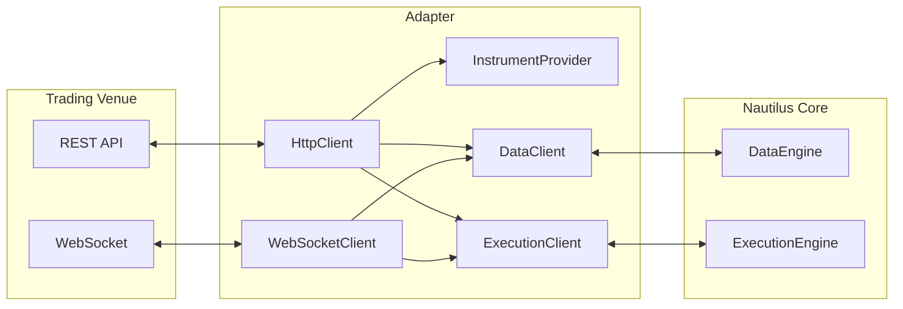

# Adapters

Adapters integrate data providers and trading venues into NautilusTrader.
They can be found in the top-level `adapters` subpackage.

An adapter typically comprises these components:



| Component            | Purpose                                                    |
|----------------------|------------------------------------------------------------|
| `HttpClient`         | REST API communication.                                    |
| `WebSocketClient`    | Real-time streaming connection.                            |
| `InstrumentProvider` | Loads and parses instrument definitions from the venue.    |
| `DataClient`         | Handles market data subscriptions and requests.            |
| `ExecutionClient`    | Handles order submission, modification, and cancellation.  |

## Instrument providers

Instrument providers parse venue API responses into Nautilus `Instrument` objects.

The use cases for the instruments available from an `InstrumentProvider` are either:

- Used standalone to discover the instruments available for an integration, using these for research or backtesting purposes
- Used in a `sandbox` or `live` [environment context](architecture.md#environment-contexts) for consumption by actors/strategies

### Research and backtesting

Here is an example of discovering the current instruments for the Binance Futures testnet:

```python
import asyncio
import os

from nautilus_trader.adapters.binance.common.enums import BinanceAccountType
from nautilus_trader.adapters.binance import get_cached_binance_http_client
from nautilus_trader.adapters.binance.futures.providers import BinanceFuturesInstrumentProvider
from nautilus_trader.common.component import LiveClock


async def main():
    clock = LiveClock()

    client = get_cached_binance_http_client(
        clock=clock,
        account_type=BinanceAccountType.USDT_FUTURES,
        api_key=os.getenv("BINANCE_FUTURES_TESTNET_API_KEY"),
        api_secret=os.getenv("BINANCE_FUTURES_TESTNET_API_SECRET"),
        is_testnet=True,
    )

    provider = BinanceFuturesInstrumentProvider(
        client=client,
        account_type=BinanceAccountType.USDT_FUTURES,
    )

    await provider.load_all_async()

    # Access loaded instruments
    instruments = provider.list_all()
    print(f"Loaded {len(instruments)} instruments")


if __name__ == "__main__":
    asyncio.run(main())
```

### Live trading

Each integration is implementation specific, and there are generally two options for the behavior of an `InstrumentProvider` within a `TradingNode` for live trading,
as configured:

- All instruments are automatically loaded on start:

```python
from nautilus_trader.config import InstrumentProviderConfig

InstrumentProviderConfig(load_all=True)
```

- Only those instruments explicitly specified in the configuration are loaded on start:

```python
InstrumentProviderConfig(load_ids=["BTCUSDT-PERP.BINANCE", "ETHUSDT-PERP.BINANCE"])
```

## Data clients

Data clients handle market data subscriptions and requests for a venue. They connect to venue APIs
and normalize incoming data into Nautilus types.

### Requesting data

Actors and strategies can request data using built-in methods. The data is returned via callbacks:

```python
from nautilus_trader.model import Instrument, InstrumentId
from nautilus_trader.trading.strategy import Strategy


class MyStrategy(Strategy):
    def on_start(self) -> None:
        # Request an instrument definition
        self.request_instrument(InstrumentId.from_str("BTCUSDT-PERP.BINANCE"))

        # Request historical bars
        self.request_bars(BarType.from_str("BTCUSDT-PERP.BINANCE-1-HOUR-LAST-EXTERNAL"))

    def on_instrument(self, instrument: Instrument) -> None:
        self.log.info(f"Received instrument: {instrument.id}")

    def on_historical_data(self, data) -> None:
        self.log.info(f"Received historical data: {data}")
```

### Subscribing to data

For real-time data, use subscription methods:

```python
def on_start(self) -> None:
    # Subscribe to live trade updates
    self.subscribe_trade_ticks(InstrumentId.from_str("BTCUSDT-PERP.BINANCE"))

    # Subscribe to live bars
    self.subscribe_bars(BarType.from_str("BTCUSDT-PERP.BINANCE-1-MINUTE-LAST-EXTERNAL"))

def on_trade_tick(self, tick: TradeTick) -> None:
    self.log.info(f"Trade: {tick}")

def on_bar(self, bar: Bar) -> None:
    self.log.info(f"Bar: {bar}")
```

:::tip
See the [Actors](actors.md) documentation for a complete reference of available
request and subscription methods with their corresponding callbacks.
:::

## Execution clients

Execution clients handle order management for a venue. They translate Nautilus order commands
into venue-specific API calls and process execution reports back into Nautilus events.

Key responsibilities:

- Submit, modify, and cancel orders.
- Process fills and execution reports.
- Reconcile order state with the venue.
- Handle account and position updates.

Order flow is managed through the `ExecutionEngine`, which routes commands to the appropriate
execution client based on the order's venue. See the [Execution](execution.md) guide for details
on order management from a strategy perspective.

:::tip
For implementing a custom adapter, see the [Adapter Developer Guide](../developer_guide/adapters.md).
:::
