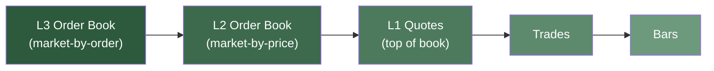

# Backtesting

Backtesting with NautilusTrader is a methodical simulation process that replicates trading
activities using a specific system implementation. This system is composed of various components
including the built-in engines, `Cache`, [MessageBus](message_bus.md), `Portfolio`, [Actors](actors.md), [Strategies](strategies.md), [Execution Algorithms](execution.md),
and other user-defined modules. The entire trading simulation is predicated on a stream of historical data processed by a
`BacktestEngine`. Once this data stream is exhausted, the engine concludes its operation, producing
detailed results and performance metrics for in-depth analysis.

It's important to recognize that NautilusTrader offers two distinct API levels for setting up and conducting backtests:

- **High-level API**: Uses a `BacktestNode` and configuration objects (`BacktestEngine`s are used internally).
- **Low-level API**: Uses a `BacktestEngine` directly with more "manual" setup.

## Choosing an API level

Consider using the **low-level** API when:

- Your entire data stream can be processed within the available machine resources (e.g., RAM).
- You prefer not to store data in the Nautilus-specific Parquet format.
- You have a specific need or preference to retain raw data in its original format (e.g., CSV, binary, etc.).
- You require fine-grained control over the `BacktestEngine`, such as the ability to re-run backtests on identical datasets while swapping out components (e.g., actors or strategies) or adjusting parameter configurations.

Consider using the **high-level** API when:

- Your data stream exceeds available memory, requiring streaming data in batches.
- You want to leverage the performance and convenience of the `ParquetDataCatalog` for storing data in the Nautilus-specific Parquet format.
- You value the flexibility and functionality of passing configuration objects to define and manage multiple backtest runs across various engines simultaneously.

## Low-level API

The low-level API centers around a `BacktestEngine`, where inputs are initialized and added manually via a Python script.
An instantiated `BacktestEngine` can accept the following:

- Lists of `Data` objects, which are automatically sorted into monotonic order based on `ts_init`.
- Multiple venues, manually initialized.
- Multiple actors, manually initialized and added.
- Multiple execution algorithms, manually initialized and added.

This approach offers detailed control over the backtesting process, allowing you to manually configure each component.

### Loading large datasets efficiently

When working with large amounts of data across multiple instruments, the way you load data
can significantly impact performance.

#### The performance consideration

By default, `BacktestEngine.add_data()` sorts the entire data stream (existing data + newly
added data) on each call when `sort=True` (the default). This means:

- First call with 1M bars: sorts 1M bars.
- Second call with 1M bars: sorts 2M bars.
- Third call with 1M bars: sorts 3M bars.
- And so on...

This repeated sorting of increasingly large datasets can become a bottleneck when loading
data for multiple instruments.

#### Optimization strategies

**Strategy 1: Defer sorting until the end (recommended for multiple instruments)**

```python
from nautilus_trader.backtest.engine import BacktestEngine

engine = BacktestEngine()

# Setup venue and instruments
engine.add_venue(...)
engine.add_instrument(instrument1)
engine.add_instrument(instrument2)
engine.add_instrument(instrument3)

# Load all data WITHOUT sorting on each call
engine.add_data(instrument1_bars, sort=False)
engine.add_data(instrument2_bars, sort=False)
engine.add_data(instrument3_bars, sort=False)

# Sort once at the end - much more efficient!
engine.sort_data()

# Now run your backtest
engine.add_strategy(strategy)
engine.run()
```

**Strategy 2: Collect and add in a single batch**

```python
# Collect all data first
all_bars = []
all_bars.extend(instrument1_bars)
all_bars.extend(instrument2_bars)
all_bars.extend(instrument3_bars)

# Add once with sorting
engine.add_data(all_bars, sort=True)
```

**Strategy 3: Use streaming API for very large datasets**

For datasets that don't fit in memory, use the streaming API:

```python
def data_generator():
    # Yield chunks of data (each chunk is a list of Data objects)
    yield load_chunk_1()
    yield load_chunk_2()
    yield load_chunk_3()

engine.add_data_iterator(
    data_name="my_data_stream",
    generator=data_generator(),
)
```

:::note
The streaming API processes data chunks on-demand during the backtest run, avoiding the need to load all data into memory upfront.
:::

:::tip Performance impact
For a backtest with 10 instruments, each with 1M bars:

- Sorting on each call: ~10 sorts of increasing size (1M, 2M, 3M, ... 10M bars).
- Sorting once at the end: 1 sort of 10M bars.

The deferred sorting approach can be **orders of magnitude faster** for large datasets.
:::

### Data loading contract

The `BacktestEngine` enforces important invariants to ensure data integrity:

**Requirements:**

- All data must be sorted before calling `run()`.
- When using `sort=False`, you **must** call `sort_data()` before running.
- The engine validates this and raises `RuntimeError` if unsorted data is detected.
- Calling `sort_data()` multiple times is safe (idempotent).

**Safety guarantees:**

- Data lists are always copied internally to prevent external mutations from affecting engine state.
- You can safely clear or modify data lists after passing them to `add_data()`.
- Adding data with `sort=True` makes it immediately available for backtesting.

This design ensures data integrity while enabling performance optimizations for large datasets.

## High-level API

The high-level API centers around a `BacktestNode`, which orchestrates the management of multiple `BacktestEngine` instances,
each defined by a `BacktestRunConfig`. Multiple configurations can be bundled into a list and processed by the node in one run.

Each `BacktestRunConfig` object consists of the following:

- A list of `BacktestDataConfig` objects.
- A list of `BacktestVenueConfig` objects.
- A list of `ImportableActorConfig` objects.
- A list of `ImportableStrategyConfig` objects.
- A list of `ImportableExecAlgorithmConfig` objects.
- An optional `ImportableControllerConfig` object.
- An optional `BacktestEngineConfig` object, with a default configuration if not specified.

## Repeated runs

When conducting multiple backtest runs, it's important to understand how components reset to avoid unexpected behavior.

### BacktestEngine.reset()

The `.reset()` method returns all stateful fields to their **initial value**, except for data and instruments which persist.

**What gets reset:**

- All trading state (orders, positions, account balances).
- Strategy instances are removed (you must re-add strategies before the next run).
- Engine counters and timestamps.

**What persists:**

- Data added via `.add_data()` (use `.clear_data()` to remove).
- Instruments (must match the persisted data).
- Venue configurations.

**Instrument handling:**

For `BacktestEngine`, instruments persist across resets by default (because data persists and instruments must match data).
This is configured via `CacheConfig.drop_instruments_on_reset=False` in the default `BacktestEngineConfig`.

### Approaches for multiple backtest runs

There are two main approaches for running multiple backtests:

#### 1. Use BacktestNode (recommended for production)

The high-level API is designed for multiple backtest runs with different configurations:

```python
from nautilus_trader.backtest.node import BacktestNode
from nautilus_trader.config import BacktestRunConfig

# Define multiple run configurations
configs = [
    BacktestRunConfig(...),  # Run 1
    BacktestRunConfig(...),  # Run 2
    BacktestRunConfig(...),  # Run 3
]

# Execute all runs
node = BacktestNode(configs=configs)
results = node.run()
```

Each run gets a fresh engine with clean state - no reset() needed.

#### 2. Use BacktestEngine.reset()

For fine-grained control with the low-level API:

```python
from nautilus_trader.backtest.engine import BacktestEngine

engine = BacktestEngine()

# Setup once
engine.add_venue(...)
engine.add_instrument(ETHUSDT)
engine.add_data(data)

# Run 1
engine.add_strategy(strategy1)
engine.run()

# Reset and run 2 - instruments and data persist
engine.reset()
engine.add_strategy(strategy2)
engine.run()

# Reset and run 3
engine.reset()
engine.add_strategy(strategy3)
engine.run()
```

:::note
Instruments and data persist across resets by default for `BacktestEngine`, making parameter optimizations straightforward.
:::

:::tip Best practices

- **For production backtesting:** Use `BacktestNode` with configuration objects.
- **For parameter optimizations:** Use `BacktestEngine.reset()` to run multiple strategies against the same data.
- **For quick experiments:** Either approach works - choose based on individual use case.
:::

## Data

Data provided for backtesting drives the execution flow. Since a variety of data types can be used,
it's crucial that your venue configurations align with the data being provided for backtesting.
Mismatches between data and configuration can lead to unexpected behavior during execution.

NautilusTrader is primarily designed and optimized for order book data, which provides
a complete representation of every price level or order in the market, reflecting the real-time behavior of a trading venue.
This ensures the highest level of execution granularity and realism. However, if granular order book data is either not
available or necessary, then the platform has the capability of processing market data in the following descending order of detail:



1. **Order Book Data/Deltas (L3 market-by-order)**:
   - Comprehensive market depth with visibility of all individual orders.

2. **Order Book Data/Deltas (L2 market-by-price)**:
   - Market depth visibility across all price levels.

3. **Quote Ticks (L1 market-by-price)**:
   - Top of book only - best bid and ask prices and sizes.

4. **Trade Ticks**:
   - Actual executed trades.

5. **Bars**:
   - Aggregated trading activity over fixed time intervals (e.g., 1-minute, 1-hour, 1-day).

### Choosing data: cost vs. accuracy

For many trading strategies, bar data (e.g., 1-minute) can be sufficient for backtesting and strategy development. This is
particularly important because bar data is typically much more accessible and cost-effective compared to tick or order book data.

Given this practical reality, Nautilus is designed to support bar-based backtesting with advanced features
that maximize simulation accuracy, even when working with lower granularity data.

:::tip
For some trading strategies, it can be practical to start development with bar data to validate core trading ideas.
If the strategy looks promising, but is more sensitive to precise execution timing (e.g., requires fills at specific prices
between OHLC levels, or uses tight take-profit/stop-loss levels), you can then invest in higher granularity data
for more accurate validation.
:::

## Venues

When initializing a venue for backtesting, you must specify its internal order `book_type` for execution processing from the following options:

- `L1_MBP`: Level 1 market-by-price (default). Only the top level of the order book is maintained.
- `L2_MBP`: Level 2 market-by-price. Order book depth is maintained, with a single order aggregated per price level.
- `L3_MBO`: Level 3 market-by-order. Order book depth is maintained, with all individual orders tracked as provided by the data.

:::note
The granularity of the data must match the specified order `book_type`. Nautilus cannot generate higher granularity data (L2 or L3) from lower-level data such as quotes, trades, or bars.
:::

:::warning
If you specify `L2_MBP` or `L3_MBO` as the venue’s `book_type`, all non-order book data (such as quotes, trades, and bars) will be ignored for execution processing.
This may cause orders to appear as though they are never filled. We are actively working on improved validation logic to prevent configuration and data mismatches.
:::

:::warning
When providing L2 or higher order book data, ensure that the `book_type` is updated to reflect the data's granularity.
Failing to do so will result in data aggregation: L2 data will be reduced to a single order per level, and L1 data will reflect only top-of-book levels.
:::

## Execution

### Data and message sequencing

In the main backtesting loop, new market data is first processed for the execution of existing orders before being processed
by the data engine that will then send data to strategies.

### Bar based execution

Bar data provides a summary of market activity with four key prices for each time period (assuming bars are aggregated by trades):

- **Open**: opening price (first trade)
- **High**: highest price traded
- **Low**: lowest price traded
- **Close**: closing price (last trade)

While this gives us an overview of price movement, we lose some important information that we'd have with more granular data:

- We don't know in what order the market hit the high and low prices.
- We can't see exactly when prices changed within the time period.
- We don't know the actual sequence of trades that occurred.

This is why Nautilus processes bar data through a system that attempts to maintain
the most realistic yet conservative market behavior possible, despite these limitations.
At its core, the platform always maintains an order book simulation - even when you provide less
granular data such as quotes, trades, or bars (although the simulation will only have a top level book).

:::warning
When using bars for execution simulation (enabled by default with `bar_execution=True` in venue configurations),
Nautilus strictly expects the initialization timestamp (`ts_init`) of each bar to represent its **closing time**.
This ensures accurate chronological processing, prevents look-ahead bias, and aligns market updates (Open → High → Low → Close) with the moment the bar is complete.

The event timestamp (`ts_event`) can represent either the open or close time of the bar:

- If `ts_event` is at the **close**, ensure `ts_init_delta=0` when processing bars (default).
- If `ts_event` is at the **open**, set `ts_init_delta` equal to the bar's duration to shift `ts_init` to the close.

:::

#### Bar timestamp convention

If your data source provides bars timestamped at the **opening time** (common in some providers), you need to ensure `ts_init` is set to the closing time for correct execution simulation. There are two approaches:

**Approach 1: Adjust data timestamps (recommended)**

- Use adapter-specific configurations like `bars_timestamp_on_close=True` (e.g., for Bybit or Databento adapters) to handle this automatically during data ingestion.
- For custom data, manually shift the timestamps by the bar duration before loading (e.g., add 1 minute for `1-MINUTE` bars).
- This approach is clearest because the data itself reflects the close time.

**Approach 2: Use `ts_init_delta` parameter**

- When calling `BarDataWrangler.process()`, set `ts_init_delta` to the bar's duration in nanoseconds (e.g., `60_000_000_000` for 1-minute bars).
- The wrangler computes `ts_init = ts_event + ts_init_delta`, shifting execution timing to the close.
- Use this when you cannot or prefer not to modify source data timestamps.

Always verify your data's timestamp convention with a small sample to avoid simulation inaccuracies. Incorrect timestamp handling can lead to look-ahead bias and unrealistic backtest results.

#### Processing bar data

Even when you provide bar data, Nautilus maintains an internal order book for each instrument, as a real venue would.

1. **Time processing**:
   - Nautilus has a specific way of handling the timing of bar data *for execution* that's crucial for accurate simulation.
   - The initialization timestamp (`ts_init`) is used for execution timing and must represent the close time of the bar. This approach is most logical because it represents the moment when the bar is fully formed and its aggregation is complete.
   - The event timestamp (`ts_event`) represents when the data event occurred and may differ from `ts_init` depending on your data source:
     - If your bars are timestamped at the **close** (the recommended default), use `ts_init_delta=0` in `BarDataWrangler` so that `ts_init = ts_event`.
     - If your bars are timestamped at the **open**, set `ts_init_delta` to the bar's duration in nanoseconds (e.g., 60_000_000_000 for 1-minute bars) to shift `ts_init` to the close time.
   - The platform ensures all events happen in the correct sequence based on `ts_init`, preventing any possibility of look-ahead bias in your backtests.

:::note Exceptions for bar execution
Bars will **not** be processed for execution (and will not update the order book) in the following cases:

- **Internally aggregated bars**: Bars with `AggregationSource.INTERNAL` are skipped to avoid processing bars that are derived from already-processed tick data.
- **Non-L1 book types**: When the venue's `book_type` is configured as `L2_MBP` or `L3_MBO`, bar data is ignored for execution processing, as bars are derived from top-of-book prices only.

In these cases, bars will still be received by strategies for analytics and decision-making, but they won't trigger order matching or update the simulated order book.
:::

2. **Price processing**:
   - The platform converts each bar's OHLC prices into a sequence of market updates.
   - These updates always follow the same order: Open → High → Low → Close.
   - If you provide multiple timeframes (like both 1-minute and 5-minute bars), the platform uses the more granular data for highest accuracy.

3. **Executions**:
   - When you place orders, they interact with the simulated order book as they would on a real venue.
   - For MARKET orders, execution happens at the current simulated market price plus any configured latency.
   - For LIMIT orders working in the market, they'll execute if any of the bar's prices reach or cross your limit price (see below).
   - The matching engine continuously processes orders as OHLC prices move, rather than waiting for complete bars.

#### OHLC prices simulation

During backtest execution, each bar is converted into a sequence of four price points:

1. Opening price
2. High price *(Order between High/Low is configurable. See `bar_adaptive_high_low_ordering` below.)*
3. Low price
4. Closing price

The trading volume for that bar is **split evenly** among these four points (25% each), with any
remainder added to the closing price trade to preserve total volume. In marginal cases, if the
bar's volume divided by 4 is less than the instrument's minimum `size_increment`, we use the
minimum `size_increment` per price point to ensure valid market activity (e.g., 1 contract for
CME group exchanges).

How these price points are sequenced can be controlled via the `bar_adaptive_high_low_ordering` parameter when configuring a venue.

Nautilus supports two modes of bar processing:

1. **Fixed ordering** (`bar_adaptive_high_low_ordering=False`, default)
   - Processes every bar in a fixed sequence: `Open → High → Low → Close`.
   - Simple and deterministic approach.

2. **Adaptive ordering** (`bar_adaptive_high_low_ordering=True`)
   - Uses bar structure to estimate likely price path:
     - If Open is closer to High: processes as `Open → High → Low → Close`.
     - If Open is closer to Low: processes as `Open → Low → High → Close`.
   - [Research](https://gist.github.com/stefansimik/d387e1d9ff784a8973feca0cde51e363) shows this approach achieves ~75-85% accuracy in predicting correct High/Low sequence (compared to statistical ~50% accuracy with fixed ordering).
   - This is particularly important when both take-profit and stop-loss levels occur within the same bar - as the sequence determines which order fills first.

Here's how to configure adaptive bar ordering for a venue, including account setup:

```python
from nautilus_trader.backtest.engine import BacktestEngine
from nautilus_trader.model.enums import OmsType, AccountType
from nautilus_trader.model import Money, Currency

# Initialize the backtest engine
engine = BacktestEngine()

# Add a venue with adaptive bar ordering and required account settings
engine.add_venue(
    venue=venue,  # Your Venue identifier, e.g., Venue("BINANCE")
    oms_type=OmsType.NETTING,
    account_type=AccountType.CASH,
    starting_balances=[Money(10_000, Currency.from_str("USDT"))],
    bar_adaptive_high_low_ordering=True,  # Enable adaptive ordering of High/Low bar prices
)
```

### Trade based execution

When you have trade tick data, enable `trade_execution=True` in your venue configuration to trigger order fills
based on trade activity. A trade tick indicates that liquidity was accessed at the trade price, allowing resting
limit orders to match.

The matching engine uses a "transient override" mechanism: during the matching process, it temporarily updates
the Best Bid (for BUYER trades) or Best Ask (for SELLER trades) to the trade price. This allows resting orders
on the passive side to cross the spread and fill. After matching, the original book state is restored, ensuring
the spread is not permanently corrupted by the transient trade price.

**Fill behavior:**

- **SELLER trade at P**: The engine temporarily sets the Best Ask to P. Resting BUY LIMIT orders at P or higher will fill (as they are willing to buy at P or more).
- **BUYER trade at P**: The engine temporarily sets the Best Bid to P. Resting SELL LIMIT orders at P or lower will fill (as they are willing to sell at P or less).

**Fill quantity capping:**

Fill quantities are capped to ensure realistic execution simulation:

- **Per-order capping**: Each order's fill quantity is limited to the minimum of the order's remaining quantity and the trade tick's size. For example, if you have a BUY LIMIT order for 100,000 units and a 200-unit SELLER trade occurs at your limit price, the order will be partially filled for 200 units (not the full 100,000).

- **Multi-order capping**: When multiple orders match the same trade tick, the total filled quantity across all orders will not exceed the trade tick's size. For example, if two BUY LIMIT orders (40 and 60 units) are resting and a 50-unit SELLER trade occurs, the first order fills for 40 units and the second fills for 10 units (the remaining trade size), totaling 50 units.

This behavior ensures that backtests don't overstate execution volumes beyond what the historical trade data indicates was actually available in the market.

**Example:**

```python
engine.add_venue(
    venue=venue,
    oms_type=OmsType.NETTING,
    account_type=AccountType.CASH,
    starting_balances=[Money(10_000, USDT)],
    trade_execution=True,
)
```

:::tip
Combine trade data with book or quote data for best results: book/quote data establishes the baseline spread,
while trade ticks trigger execution for orders that might be inside the spread or ahead of the quote updates.
:::

### Slippage and spread handling

When backtesting with different types of data, Nautilus implements specific handling for slippage and spread simulation:

For L2 (market-by-price) or L3 (market-by-order) data, slippage is simulated with high accuracy by:

- Filling orders against actual order book levels.
- Matching available size at each price level sequentially.
- Maintaining realistic order book depth impact (per order fill).

For L1 data types (e.g., L1 order book, trades, quotes, bars), slippage is handled through:

**Initial fill slippage** (`prob_slippage`):

- Controlled by the `prob_slippage` parameter of the `FillModel`.
- Determines if the initial fill will occur one tick away from current market price.
- Example: With `prob_slippage=0.5`, a market BUY has 50% chance of filling one tick above the best ask price.

:::note
When backtesting with bar data, be aware that the reduced granularity of price information affects the slippage mechanism.
For the most realistic backtesting results, consider using higher granularity data sources such as L2 or L3 order book data when available.
:::

### Fill model

The `FillModel` helps simulate order queue position and execution in a simple probabilistic way during backtesting.
It addresses a fundamental challenge: *even with perfect historical market data, we can't fully simulate how orders may have interacted with other
market participants in real-time*.

The `FillModel` simulates two key aspects of trading that exist in real markets regardless of data quality:

1. **Queue position for limit orders**:
   - When multiple traders place orders at the same price level, the order's position in the queue affects if and when it gets filled.

2. **Market impact and competition**:
   - When taking liquidity with market orders, you compete with other traders for available liquidity, which can affect your fill price.

#### Configuration and parameters

```python
from nautilus_trader.backtest.config import BacktestVenueConfig
from nautilus_trader.backtest.config import ImportableFillModelConfig

# Configure a custom fill model for the venue
venue_config = BacktestVenueConfig(
    name="SIM",
    oms_type="NETTING",
    account_type="CASH",
    starting_balances=["100_000 USD"],
    fill_model=ImportableFillModelConfig(
        fill_model_path="nautilus_trader.backtest.models:FillModel",
        config_path="nautilus_trader.backtest.config:FillModelConfig",
        config={
            "prob_fill_on_limit": 0.2,    # Chance a limit order fills when price matches
            "prob_fill_on_stop": 0.95,    # [DEPRECATED] Use `prob_slippage` instead
            "prob_slippage": 0.5,         # Chance of 1-tick slippage (L1 data only)
            "random_seed": 42,            # Optional: Set for reproducible results
        },
    ),
)
```

**prob_fill_on_limit** (default: `1.0`)

- Purpose:
  - Simulates the probability of a limit order getting filled when its price level is reached in the market.
- Details:
  - Simulates your position in the order queue at a given price level.
  - Applies to all data types (e.g., L1/L2/L3 order book, quotes, trades, bars).
  - New random probability check occurs each time market price touches your order price (but does not move through it).
  - On successful probability check, fills entire remaining order quantity.

**Examples**:

- With `prob_fill_on_limit=0.0`:
  - Limit BUY orders never fill when best ask reaches the limit price.
  - Limit SELL orders never fill when best bid reaches the limit price.
  - This simulates being at the very back of the queue and never reaching the front.
- With `prob_fill_on_limit=0.5`:
  - Limit BUY orders have 50% chance of filling when best ask reaches the limit price.
  - Limit SELL orders have 50% chance of filling when best bid reaches the limit price.
  - This simulates being in the middle of the queue.
- With `prob_fill_on_limit=1.0` (default):
  - Limit BUY orders always fill when best ask reaches the limit price.
  - Limit SELL orders always fill when best bid reaches the limit price.
  - This simulates being at the front of the queue with guaranteed fills.

**prob_slippage** (default: `0.0`)

- Purpose:
  - Simulates the probability of experiencing price slippage when executing market orders.
- Details:
  - Only applies to L1 data types (e.g., quotes, trades, bars).
  - When triggered, moves fill price one tick against your order direction.
  - Affects all market-type orders (`MARKET`, `MARKET_TO_LIMIT`, `MARKET_IF_TOUCHED`, `STOP_MARKET`).
  - Not utilized with L2/L3 data where order book depth can determine slippage.

**Examples**:

- With `prob_slippage=0.0` (default):
  - No artificial slippage is applied, representing an idealized scenario where you always get filled at the current market price.
- With `prob_slippage=0.5`:
  - Market BUY orders have 50% chance of filling one tick above the best ask price, and 50% chance at the best ask price.
  - Market SELL orders have 50% chance of filling one tick below the best bid price, and 50% chance at the best bid price.
- With `prob_slippage=1.0`:
  - Market BUY orders always fill one tick above the best ask price.
  - Market SELL orders always fill one tick below the best bid price.
  - This simulates consistent adverse price movement against your orders.

**prob_fill_on_stop** (default: `1.0`)

- A stop order is a shorter name for a stop-market order, which converts to a market order when the market price touches the stop price.
- Stop order fill mechanics follow market order mechanics, controlled by the `prob_slippage` parameter.

:::warning
The `prob_fill_on_stop` parameter is deprecated and will be removed in a future version (use `prob_slippage` instead).
:::

#### How simulation varies by data type

The behavior of the `FillModel` adapts based on the order book type being used:

**L2/L3 order book data**

With full order book depth, the `FillModel` focuses purely on simulating queue position for limit orders through `prob_fill_on_limit`.
The order book itself handles slippage naturally based on available liquidity at each price level.

- `prob_fill_on_limit` is active - simulates queue position.
- `prob_slippage` is not used - real order book depth determines price impact.

**L1 order book data**

With only best bid/ask prices available, the `FillModel` provides additional simulation:

- `prob_fill_on_limit` is active - simulates queue position.
- `prob_slippage` is active - simulates basic price impact since we lack real depth information.

**Bar/Quote/Trade data**

When using less granular data, the same behaviors apply as L1:

- `prob_fill_on_limit` is active - simulates queue position.
- `prob_slippage` is active - simulates basic price impact.

#### Important considerations

The `FillModel` has certain limitations to keep in mind:

- **Partial fills are supported** with L2/L3 order book data - when there is no longer any size available in the order book, no more fills will be generated and the order will remain in a partially filled state. This accurately simulates real market conditions where not enough liquidity is available at the desired price levels.
- With L1 data, slippage limits to a fixed 1-tick, at which the system fills the entire order's quantity.

:::note
As the `FillModel` continues to evolve, future versions may introduce more sophisticated simulation of order execution dynamics, including:

- Partial fill simulation.
- Variable slippage based on order size.
- More complex queue position modeling.

:::

## Account types

When you attach a venue to the engine—either for live trading or a back‑test—you must pick one of three accounting modes by passing the `account_type` parameter:

| Account type           | Typical use-case                                         | What the engine locks                                                                                              |
| ---------------------- | -------------------------------------------------------- | -------------------------------------------------------------------------------------------------------------------|
| Cash                   | Spot trading (e.g. BTC/USDT, stocks)                     | Notional value for every position a pending order would open.                                                      |
| Margin                 | Derivatives or any product that allows leverage          | Initial margin for each order plus maintenance margin for open positions.                                          |
| Betting                | Sports betting, book‑making                              | Stake required by the venue; no leverage.                                                                          |

Example of adding a `CASH` account for a backtest venue:

```python
from nautilus_trader.adapters.binance import BINANCE_VENUE
from nautilus_trader.backtest.engine import BacktestEngine
from nautilus_trader.model.currencies import USDT
from nautilus_trader.model.enums import OmsType, AccountType
from nautilus_trader.model import Money, Currency

# Initialize the backtest engine
engine = BacktestEngine()

# Add a CASH account for the venue
engine.add_venue(
    venue=BINANCE_VENUE,  # Create or reference a Venue identifier
    oms_type=OmsType.NETTING,
    account_type=AccountType.CASH,
    starting_balances=[Money(10_000, USDT)],
)
```

### Cash accounts

Cash accounts settle trades in full; there is no leverage and therefore no concept of margin.

### Margin accounts

A *margin account* facilitates trading of instruments requiring margin, such as futures or leveraged products.
It tracks account balances, calculates required margins, and manages leverage to ensure sufficient collateral for positions and orders.

**Key concepts**:

- **Leverage**: Amplifies trading exposure relative to account equity. Higher leverage increases potential returns and risks.
- **Initial Margin**: Collateral required to submit an order to open a position.
- **Maintenance Margin**: Minimum collateral required to maintain an open position.
- **Locked Balance**: Funds reserved as collateral, unavailable for new orders or withdrawals.

:::note
Reduce-only orders **do not** contribute to `balance_locked` in cash accounts,
nor do they add to initial margin in margin accounts—as they can only reduce existing exposure.
:::

### Betting accounts

Betting accounts are specialised for venues where you stake an amount to win or lose a fixed payout (some prediction markets, sports books, etc.).
The engine locks only the stake required by the venue; leverage and margin are not applicable.

## Margin models

NautilusTrader provides flexible margin calculation models to accommodate different venue types and trading scenarios.

### Overview

Different venues and brokers have varying approaches to calculating margin requirements:

- **Traditional Brokers** (Interactive Brokers, TD Ameritrade): Fixed margin percentages regardless of leverage.
- **Crypto Exchanges** (Binance, some others): Leverage may reduce margin requirements.
- **Futures Exchanges** (CME, ICE): Fixed margin amounts per contract.

### Available models

#### StandardMarginModel

Uses fixed percentages without leverage division, matching traditional broker behavior.

**Formula:**

```python
# Fixed percentages - leverage ignored
margin = notional * instrument.margin_init
```

- Initial Margin = `notional_value * instrument.margin_init`
- Maintenance Margin = `notional_value * instrument.margin_maint`

**Use cases:**

- Traditional brokers (Interactive Brokers, TD Ameritrade).
- Futures exchanges (CME, ICE).
- Forex brokers with fixed margin requirements.

#### LeveragedMarginModel

Divides margin requirements by leverage.

**Formula:**

```python
# Leverage reduces margin requirements
adjusted_notional = notional / leverage
margin = adjusted_notional * instrument.margin_init
```

- Initial Margin = `(notional_value / leverage) * instrument.margin_init`
- Maintenance Margin = `(notional_value / leverage) * instrument.margin_maint`

**Use cases:**

- Crypto exchanges that reduce margin with leverage.
- Venues where leverage affects margin requirements.

### Usage

#### Programmatic configuration

```python
from nautilus_trader.backtest.models import LeveragedMarginModel
from nautilus_trader.backtest.models import StandardMarginModel
from nautilus_trader.test_kit.stubs.execution import TestExecStubs

# Create account
account = TestExecStubs.margin_account()

# Set standard model for traditional brokers
standard_model = StandardMarginModel()
account.set_margin_model(standard_model)

# Or use leveraged model for crypto exchanges
leveraged_model = LeveragedMarginModel()
account.set_margin_model(leveraged_model)
```

#### Backtest configuration

```python
from nautilus_trader.backtest.config import BacktestVenueConfig
from nautilus_trader.backtest.config import MarginModelConfig

venue_config = BacktestVenueConfig(
    name="SIM",
    oms_type="NETTING",
    account_type="MARGIN",
    starting_balances=["1_000_000 USD"],
    margin_model=MarginModelConfig(model_type="standard"),  # Options: 'standard', 'leveraged'
)
```

#### Available model types

- `"leveraged"`: Margin reduced by leverage (default).
- `"standard"`: Fixed percentages (traditional brokers).
- Custom class path: `"my_package.my_module.MyMarginModel"`.

#### Default behavior

By default, `MarginAccount` uses `LeveragedMarginModel`.

#### Real-world example

**EUR/USD Trading Scenario:**

- **Instrument**: EUR/USD
- **Quantity**: 100,000 EUR
- **Price**: 1.10000
- **Notional Value**: $110,000
- **Leverage**: 50x
- **Instrument Margin Init**: 3%

**Margin calculations:**

| Model     | Calculation           | Result  | Percentage |
|-----------|----------------------|---------|------------|
| Standard  | $110,000 × 0.03      | $3,300  | 3.00%      |
| Leveraged | ($110,000 ÷ 50) × 0.03 | $66   | 0.06%      |

**Account balance impact:**

- **Account Balance**: $10,000
- **Standard Model**: Cannot trade (requires $3,300 margin)
- **Leveraged Model**: Can trade (requires only $66 margin)

### Real-world scenarios

#### Interactive Brokers EUR/USD futures

```python
# IB requires fixed margin regardless of leverage
account.set_margin_model(StandardMarginModel())
margin = account.calculate_margin_init(instrument, quantity, price)
# Result: Fixed percentage of notional value
```

#### Binance crypto trading

```python
# Binance may reduce margin with leverage
account.set_margin_model(LeveragedMarginModel())
margin = account.calculate_margin_init(instrument, quantity, price)
# Result: Margin reduced by leverage factor
```

### Model selection

#### Using the default model

The default `LeveragedMarginModel` works out of the box:

```python
account = TestExecStubs.margin_account()
margin = account.calculate_margin_init(instrument, quantity, price)
```

#### Using the standard model

For traditional broker behavior:

```python
account.set_margin_model(StandardMarginModel())
margin = account.calculate_margin_init(instrument, quantity, price)
```

### Custom models

You can create custom margin models by inheriting from `MarginModel`. Custom models receive configuration through the `MarginModelConfig`:

```python
from nautilus_trader.backtest.models import MarginModel
from nautilus_trader.backtest.config import MarginModelConfig

class RiskAdjustedMarginModel(MarginModel):
    def __init__(self, config: MarginModelConfig):
        """Initialize with configuration parameters."""
        self.risk_multiplier = Decimal(str(config.config.get("risk_multiplier", 1.0)))
        self.use_leverage = config.config.get("use_leverage", False)

    def calculate_margin_init(self, instrument, quantity, price, leverage, use_quote_for_inverse=False):
        notional = instrument.notional_value(quantity, price, use_quote_for_inverse)
        if self.use_leverage:
            adjusted_notional = notional.as_decimal() / leverage
        else:
            adjusted_notional = notional.as_decimal()
        margin = adjusted_notional * instrument.margin_init * self.risk_multiplier
        return Money(margin, instrument.quote_currency)

    def calculate_margin_maint(self, instrument, side, quantity, price, leverage, use_quote_for_inverse=False):
        return self.calculate_margin_init(instrument, quantity, price, leverage, use_quote_for_inverse)
```

#### Using custom models

**Programmatic:**

```python
from nautilus_trader.backtest.config import MarginModelConfig
from nautilus_trader.backtest.config import MarginModelFactory

config = MarginModelConfig(
    model_type="my_package.my_module:RiskAdjustedMarginModel",
    config={"risk_multiplier": 1.5, "use_leverage": False}
)

custom_model = MarginModelFactory.create(config)
account.set_margin_model(custom_model)
```

### High-level backtest API configuration

When using the high-level backtest API, you can specify margin models in your venue configuration using `MarginModelConfig`:

```python
from nautilus_trader.backtest.config import MarginModelConfig
from nautilus_trader.backtest.config import BacktestVenueConfig
from nautilus_trader.config import BacktestRunConfig

# Configure venue with specific margin model
venue_config = BacktestVenueConfig(
    name="SIM",
    oms_type="NETTING",
    account_type="MARGIN",
    starting_balances=["1_000_000 USD"],
    margin_model=MarginModelConfig(
        model_type="standard"  # Use standard model for traditional broker simulation
    ),
)

# Use in backtest configuration
config = BacktestRunConfig(
    venues=[venue_config],
    # ... other config
)
```

#### Configuration examples

**Standard model (traditional brokers):**

```python
margin_model=MarginModelConfig(model_type="standard")
```

**Leveraged model (default):**

```python
margin_model=MarginModelConfig(model_type="leveraged")  # Default
```

**Custom model with configuration:**

```python
margin_model=MarginModelConfig(
    model_type="my_package.my_module:CustomMarginModel",
    config={
        "risk_multiplier": 1.5,
        "use_leverage": False,
        "volatility_threshold": 0.02,
    }
)
```

The margin model will be automatically applied to the simulated exchange during backtest execution.
