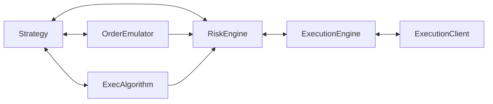

# Execution

NautilusTrader can handle trade execution and order management for multiple strategies and venues
simultaneously (per instance). Several interacting components are involved in execution, making it
crucial to understand the possible flows of execution messages (commands and events).

The main execution-related components include:

- `Strategy`
- `ExecAlgorithm` (execution algorithms)
- `OrderEmulator`
- `RiskEngine`
- `ExecutionEngine` or `LiveExecutionEngine`
- `ExecutionClient` or `LiveExecutionClient`

## Execution flow

The `Strategy` base class inherits from `Actor` and so contains all of the common data related
methods. It also provides methods for managing orders and trade execution:

- `submit_order(...)`
- `submit_order_list(...)`
- `modify_order(...)`
- `cancel_order(...)`
- `cancel_orders(...)`
- `cancel_all_orders(...)`
- `close_position(...)`
- `close_all_positions(...)`
- `query_account(...)`
- `query_order(...)`

These methods create the necessary execution commands under the hood and send them on the message
bus to the relevant components (point-to-point), as well as publishing any events (such as the
initialization of new orders i.e. `OrderInitialized` events).

The general execution flow looks like the following (each arrow indicates movement across the message bus):

`Strategy` -> `OrderEmulator` -> `ExecAlgorithm` -> `RiskEngine` -> `ExecutionEngine` -> `ExecutionClient`

The `OrderEmulator` and `ExecAlgorithm`(s) components are optional in the flow, depending on
individual order parameters (as explained below).

This diagram illustrates message flow (commands and events) across the Nautilus execution components.



## Order Management System (OMS)

An order management system (OMS) type refers to the method used for assigning orders to positions and tracking those positions for an instrument.
OMS types apply to both strategies and venues (simulated and real). Even if a venue doesn't explicitly
state the method in use, an OMS type is always in effect. The OMS type for a component can be specified
using the `OmsType` enum.

The `OmsType` enum has three variants:

- `UNSPECIFIED`: The OMS type defaults based on where it is applied (details below)
- `NETTING`: Positions are combined into a single position per instrument ID
- `HEDGING`: Multiple positions per instrument ID are supported (both long and short)

The table below describes different configuration combinations and their applicable scenarios.
When the strategy and venue OMS types differ, the `ExecutionEngine` handles this by overriding or assigning `position_id` values for received `OrderFilled` events.
A "virtual position" refers to a position ID that exists within the Nautilus system but not on the venue in
reality.

| Strategy OMS                 | Venue OMS              | Description                                                                                                                                                |
|:-----------------------------|:-----------------------|:-----------------------------------------------------------------------------------------------------------------------------------------------------------|
| `NETTING`                    | `NETTING`              | The strategy uses the venue's native OMS type, with a single position ID per instrument ID.                                                                 |
| `HEDGING`                    | `HEDGING`              | The strategy uses the venue's native OMS type, with multiple position IDs per instrument ID (both `LONG` and `SHORT`).                                      |
| `NETTING`                    | `HEDGING`              | The strategy **overrides** the venue's native OMS type. The venue tracks multiple positions per instrument ID, but Nautilus maintains a single position ID. |
| `HEDGING`                    | `NETTING`              | The strategy **overrides** the venue's native OMS type. The venue tracks a single position per instrument ID, but Nautilus maintains multiple position IDs. |

:::note
Configuring OMS types separately for strategies and venues increases platform complexity but allows
for a wide range of trading styles and preferences (see below).
:::

OMS config examples:

- Most cryptocurrency exchanges use a `NETTING` OMS type, representing a single position per market. It may be desirable for a trader to track multiple "virtual" positions for a strategy.
- Some FX ECNs or brokers use a `HEDGING` OMS type, tracking multiple positions both `LONG` and `SHORT`. The trader may only care about the NET position per currency pair.

:::info
Nautilus does not yet support venue-side hedging modes such as Binance `BOTH` vs. `LONG/SHORT` where the venue nets per direction.
It is advised to keep Binance account configurations as `BOTH` so that a single position is netted.
:::

### OMS configuration

If a strategy OMS type is not explicitly set using the `oms_type` configuration option,
it will default to `UNSPECIFIED`. This means the `ExecutionEngine` will not override any venue `position_id`s,
and the OMS type will follow the venue's OMS type.

:::tip
When configuring a backtest, you can specify the `oms_type` for the venue. To enhance backtest
accuracy, it is recommended to match this with the actual OMS type used by the venue in practice.
:::

## Risk engine

The `RiskEngine` is a core component of every Nautilus system, including backtest, sandbox, and live environments.
Every order command and event passes through the `RiskEngine` unless specifically bypassed in the `RiskEngineConfig`.

The `RiskEngine` includes several built-in pre-trade risk checks, including:

- Price precisions correct for the instrument.
- Prices are positive (unless an option type instrument)
- Quantity precisions correct for the instrument.
- Below maximum notional for the instrument.
- Within maximum or minimum quantity for the instrument.
- Only reducing position when a `reduce_only` execution instruction is specified for the order.

If any risk check fails, the system generates an `OrderDenied` event, effectively closing the order and
preventing it from progressing further. This event includes a human-readable reason for the denial.

### Trading state

Additionally, the current trading state of a Nautilus system affects order flow.

The `TradingState` enum has three variants:

- `ACTIVE`: Operates normally.
- `HALTED`: Does not process further order commands until state changes.
- `REDUCING`: Only processes cancels or commands that reduce open positions.

:::info
See the `RiskEngineConfig` [API Reference](../api_reference/config#risk) for further details.
:::

## Execution algorithms

The platform supports customized execution algorithm components and provides some built-in
algorithms, such as the Time-Weighted Average Price (TWAP) algorithm.

### TWAP (Time-Weighted Average Price)

The TWAP execution algorithm aims to execute orders by evenly spreading them over a specified
time horizon. The algorithm receives a primary order representing the total size and direction
then splits this by spawning smaller child orders, which are then executed at regular intervals
throughout the time horizon.

This helps to reduce the impact of the full size of the primary order on the market, by
minimizing the concentration of trade size at any given time.

The algorithm will immediately submit the first order, with the final order submitted being the
primary order at the end of the horizon period.

Using the TWAP algorithm as an example (found in ``/examples/algorithms/twap.py``), this example
demonstrates how to initialize and register a TWAP execution algorithm directly with a
`BacktestEngine` (assuming an engine is already initialized):

```python
from nautilus_trader.examples.algorithms.twap import TWAPExecAlgorithm

# `engine` is an initialized BacktestEngine instance
exec_algorithm = TWAPExecAlgorithm()
engine.add_exec_algorithm(exec_algorithm)
```

For this particular algorithm, two parameters must be specified:

- `horizon_secs`
- `interval_secs`

The `horizon_secs` parameter determines the time period over which the algorithm will execute, while
the `interval_secs` parameter sets the time between individual order executions. These parameters
determine how a primary order is split into a series of spawned orders.

```python
from decimal import Decimal
from nautilus_trader.model.data import BarType
from nautilus_trader.test_kit.providers import TestInstrumentProvider
from nautilus_trader.examples.strategies.ema_cross_twap import EMACrossTWAP, EMACrossTWAPConfig

# Configure your strategy
config = EMACrossTWAPConfig(
    instrument_id=TestInstrumentProvider.ethusdt_binance().id,
    bar_type=BarType.from_str("ETHUSDT.BINANCE-250-TICK-LAST-INTERNAL"),
    trade_size=Decimal("0.05"),
    fast_ema_period=10,
    slow_ema_period=20,
    twap_horizon_secs=10.0,   # execution algorithm parameter (total horizon in seconds)
    twap_interval_secs=2.5,    # execution algorithm parameter (seconds between orders)
)

# Instantiate your strategy
strategy = EMACrossTWAP(config=config)
```

Alternatively, you can specify these parameters dynamically per order, determining them based on
actual market conditions. In this case, the strategy configuration parameters could be provided to
an execution model which determines the horizon and interval.

:::info
There is no limit to the number of execution algorithm parameters you can create. The parameters
must be a dictionary with string keys and primitive values (values that can be serialized
over the wire, such as ints, floats, and strings).
:::

### Writing execution algorithms

To implement a custom execution algorithm you must define a class which inherits from `ExecAlgorithm`.

An execution algorithm is a type of `Actor`, so it's capable of the following:

- Request and subscribe to data.
- Access the `Cache`.
- Set time alerts and/or timers using a `Clock`.

Additionally it can:

- Access the central `Portfolio`.
- Spawn secondary orders from a received primary (original) order.

Once an execution algorithm is registered, and the system is running, it will receive orders off the
messages bus which are addressed to its `ExecAlgorithmId` via the `exec_algorithm_id` order parameter.
The order may also carry the `exec_algorithm_params` being a `dict[str, Any]`.

:::warning
Because of the flexibility of the `exec_algorithm_params` dictionary, it's important to thoroughly
validate all of the key value pairs for correct operation of the algorithm (for starters that the
dictionary is not ``None`` and all necessary parameters actually exist).
:::

Received orders will arrive via the following `on_order(...)` method. These received orders are
known as "primary" (original) orders when being handled by an execution algorithm.

```python
from nautilus_trader.model.orders.base import Order

def on_order(self, order: Order) -> None:
    # Handle the order here
```

When the algorithm is ready to spawn a secondary order, it can use one of the following methods:

- `spawn_market(...)` (spawns a `MARKET` order)
- `spawn_market_to_limit(...)` (spawns a `MARKET_TO_LIMIT` order)
- `spawn_limit(...)` (spawns a `LIMIT` order)

:::note
Additional order types will be implemented in future versions, as the need arises.
:::

Each of these methods takes the primary (original) `Order` as the first argument. The primary order
quantity will be reduced by the `quantity` passed in (becoming the spawned orders quantity).

:::warning
There must be enough primary order quantity remaining (this is validated).
:::

Once the desired number of secondary orders have been spawned, and the execution routine is over,
the intention is that the algorithm will then finally send the primary (original) order.

### Spawned orders

All secondary orders spawned from an execution algorithm will carry a `exec_spawn_id` which is
the `ClientOrderId` of the primary (original) order, and whose `client_order_id`
derives from this original identifier with the following convention:

- `exec_spawn_id` (primary order `client_order_id` value)
- `spawn_sequence` (the sequence number for the spawned order)

```
{exec_spawn_id}-E{spawn_sequence}
```

e.g. `O-20230404-001-000-E1` (for the first spawned order)

:::note
The "primary" and "secondary" / "spawn" terminology was specifically chosen to avoid conflict
or confusion with the "parent" and "child" contingent orders terminology (an execution algorithm may also deal with contingent orders).
:::

### Managing execution algorithm orders

The `Cache` provides several methods to aid in managing (keeping track of) the activity of
an execution algorithm. Calling the below method will return all execution algorithm orders
for the given query filters.

```python
def orders_for_exec_algorithm(
    self,
    exec_algorithm_id: ExecAlgorithmId,
    venue: Venue | None = None,
    instrument_id: InstrumentId | None = None,
    strategy_id: StrategyId | None = None,
    side: OrderSide = OrderSide.NO_ORDER_SIDE,
) -> list[Order]:
```

As well as more specifically querying the orders for a certain execution series/spawn.
Calling the below method will return all orders for the given `exec_spawn_id` (if found).

```python
def orders_for_exec_spawn(self, exec_spawn_id: ClientOrderId) -> list[Order]:
```

:::note
This also includes the primary (original) order.
:::

## Own order books

Own order books are L3 order books that track only your own (user) orders organized by price level, maintained separately from the venue's public order books.

### Purpose

Own order books serve several purposes:

- Monitor the state of your orders within the venue's public book in real-time.
- Validate order placement by checking available liquidity at price levels before submission.
- Help prevent self-trading by identifying price levels where your own orders already exist.
- Support advanced order management strategies that depend on queue position.
- Enable reconciliation between internal state and venue state during live trading.

### Lifecycle

Own order books are maintained per instrument and automatically updated as orders transition through their lifecycle.
Orders are added when submitted or accepted, updated when modified, and removed when filled, canceled, rejected, or expired.

Only orders with prices can be represented in own order books. Market orders and other order types without explicit prices are excluded since they cannot be positioned at specific price levels.

### Safe cancellation queries

When querying own order books for orders to cancel, use a `status` filter that **excludes** `PENDING_CANCEL` to avoid processing orders already being cancelled.

:::warning
Including `PENDING_CANCEL` in status filters can cause:

- Duplicate cancel attempts on the same order.
- Inflated open order counts (orders in `PENDING_CANCEL` remain "open" until confirmed canceled).
- Order state explosion when multiple strategies attempt to cancel the same orders.

:::

The optional `accepted_buffer_ns` many methods expose is a time-based guard that only returns orders whose `ts_accepted` is at least that many nanoseconds in the past. Orders that have not yet been accepted by the venue still have `ts_accepted = 0`, so they are included once the buffer window elapses. To exclude those inflight orders you must pair the buffer with an explicit status filter (for example, restrict to `ACCEPTED` / `PARTIALLY_FILLED`).

### Auditing

During live trading, own order books can be periodically audited against the cache's order indexes to ensure consistency.
The audit mechanism verifies that closed orders are properly removed and that inflight orders (submitted but not yet accepted) remain tracked during venue latency windows.

The audit interval can be configured using the `own_books_audit_interval_secs` parameter in live trading configurations.

## Overfills

An overfill occurs when the cumulative fill quantity for an order exceeds the original order quantity.
For example, an order for 100 units that receives fills totaling 110 units has an overfill of 10 units.

### How overfills occur

Overfills can result from two fundamentally different causes:

- Duplicate fill events (a network/messaging issue).
- Genuine overfills at the matching engine (a real execution outcome).

**Genuine overfills at the matching engine**

In some cases, the matching engine actually executes more quantity than the order requested.
This is a real execution outcome, not a duplicate event:

- **Matching engine race conditions**: In fast markets with high concurrency, an order may match
  against multiple counterparties nearly simultaneously before being fully removed from the book.
- **Minimum lot size constraints**: If an order's remaining quantity falls below the venue's minimum
  tradeable lot, some matching engines fill the minimum lot anyway rather than leaving an untradeable remainder.
- **DEX/AMM mechanics**: Decentralized exchanges using automated market makers may have execution
  mechanics where actual fill quantities differ slightly from requested due to price impact calculations.
- **Multi-fill atomicity**: Some venues do not guarantee atomic fill quantities across partial
  executions, allowing aggregate fills to exceed the original order quantity.

**Duplicate fill events**

Separate from genuine overfills, the same fill event may be delivered multiple times:

- WebSocket reconnection replaying previously received events.
- The venue's internal retry or delivery guarantee mechanisms.
- API timing issues in the venue's execution reporting.

The system handles duplicate events via `trade_id` deduplication (see below), but duplicates with
different `trade_id` values require overfill handling.

**Race conditions with reconciliation**

During live trading, the system maintains state through two parallel channels:

- Real-time fill events arriving via WebSocket.
- Periodic reconciliation polling the venue for fill history.

If the same fill arrives through both channels with different identifiers before deduplication
can occur, both may be applied to the order. This is particularly likely during:

- System startup when reconciliation runs while WebSocket connections are establishing.
- Network instability causing reconnections mid-fill.
- High-frequency trading where fills arrive faster than reconciliation cycles.

The likelihood of reconciliation race conditions increases when:

- **Thresholds are reduced**: The `open_check_threshold_ms` and `inflight_check_threshold_ms` settings
  (both default to 5,000 ms) define how long the engine waits before acting on discrepancies.
  Reducing these below the round-trip latency to your venue increases the chance of processing
  a fill via reconciliation before the real-time event arrives (or vice versa).
- **Reconciliation frequency is increased**: Setting `open_check_interval_secs` to aggressive values
  (e.g., 1-2 seconds) increases how often the system polls the venue, creating more opportunities
  for race conditions with real-time events.
- **Startup delay is reduced**: The `reconciliation_startup_delay_secs` setting (default 10 seconds)
  provides time for WebSocket connections to stabilize before continuous reconciliation begins.
  Reducing this increases the chance of duplicate fills during the startup window.

See [Continuous reconciliation](live.md#continuous-reconciliation) for configuration details.

### System behavior

The `ExecutionEngine` checks for potential overfills before applying each fill event by comparing
the order's current `filled_qty` plus the incoming `last_qty` against the original `quantity`.

The `allow_overfills` configuration option (default: `False`) controls how overfills are handled:

| `allow_overfills` | Behavior                                                                   |
|-------------------|----------------------------------------------------------------------------|
| `False`           | Logs an error and rejects the fill, preserving the order's current state.  |
| `True`            | Logs a warning, applies the fill, and tracks the excess in `overfill_qty`. |

When overfills are allowed, the order's `overfill_qty` field tracks the excess quantity.
The order transitions to `FILLED` status and `leaves_qty` is clamped to zero.

### Duplicate fill detection

The `Order` model enforces that each `trade_id` can only be applied once. Inside `Order.apply()`,
a hard check raises an error if the incoming fill's `trade_id` already exists on the order.
This is the invariant that prevents double-counting executions.

**Core engine path (backtest and real-time event processing)**

In the core `ExecutionEngine` (used for backtests and processing real-time fill events), before
calling `apply()`, the engine checks `Order.is_duplicate_fill()` which compares:

- `trade_id`
- `order_side`
- `last_px`
- `last_qty`

If all fields match an existing fill exactly, the event is skipped gracefully with a warning log.
This avoids raising an error for benign exact replays (e.g., from WebSocket reconnection).
If the `trade_id` matches but other fields differ ("noisy replay"), the 4-field check passes
but `Order.apply()` will raise an error due to the duplicate `trade_id`. The engine catches
this error, logs the exception with full context, and drops the fill - it does not crash.

**Live reconciliation sanitizer**

During live reconciliation, `LiveExecutionEngine` pre-filters on `trade_id` alone *before*
generating fill events. This check runs before the 4-field check described above. If a fill
report arrives with a `trade_id` that already exists on the order, it is skipped regardless
of whether the price or quantity differs. When the data does differ, a warning is logged to
alert operators to potential venue data quality issues.

This pre-filtering ensures that "noisy duplicates" from venue replays or reconciliation races
are filtered out before they can trigger model integrity errors. If a venue legitimately needs
to correct fill data, it should use proper execution report semantics rather than resending
with the same `trade_id`.

### Configuration

For live trading, enable overfill tolerance in the `LiveExecEngineConfig`:

```python
from nautilus_trader.live.config import LiveExecEngineConfig

config = LiveExecEngineConfig(
    allow_overfills=True,  # Log warning instead of rejecting
)
```

:::tip
Enable `allow_overfills=True` when trading on venues known to emit duplicate fills or when
position reconciliation races with exchange fill events are expected. Monitor the logs for
overfill warnings to identify patterns that may require venue-specific handling.
:::

:::warning
When `allow_overfills=False` (the default), rejected fills may cause position discrepancies
between the system and the venue. Use the [reconciliation](live.md#execution-reconciliation)
features to detect and resolve such discrepancies.
:::
